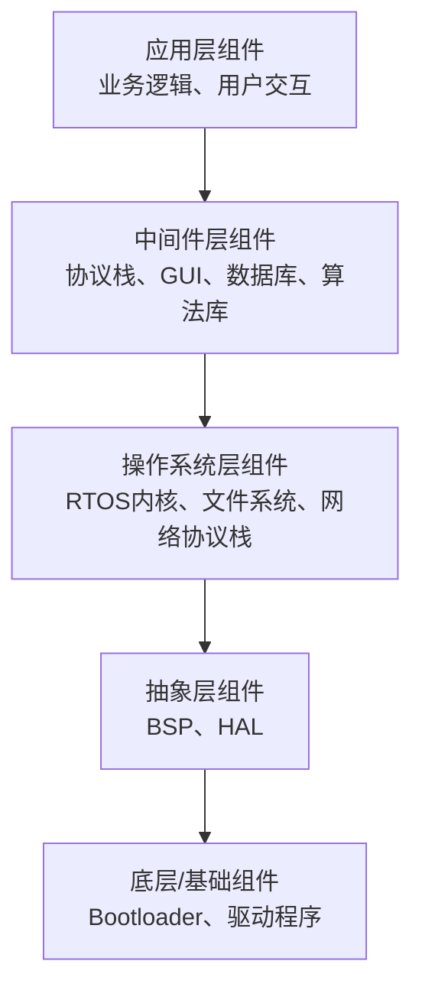

<!--
 * @Author: Clark
 * @Email: haixuanwoTxh@gmail.com
 * @Date: 2026-04-23 20:00:36
 * @LastEditors: Clark
 * @LastEditTime: 2026-04-23 20:55:55
 * @Description: file content
-->

**软件组件**可以理解为：**一个可独立制作、组装、替换和复用的软件“零件”**。

它不是一段随意写的代码，而是为了系统化构建大型软件而设计出来的、有明确规范的模块。

为了更直观理解，可以从这几个核心特征来把握：

### 1. 核心特征（就像一个“好的乐高积木”）

-   **独立性**：组件不依赖具体的编译环境或运行上下文。你可以把它从A项目里“拿”出来，放到B项目里，稍作配置甚至无需改动就能用。
-   **封装性**：组件内部逻辑对外是“黑盒子”。使用者**不需要知道它内部怎么实现**，只知道它对外提供了什么功能。
-   **明确的接口**：组件通过**接口**与外界交互。接口规定了：**“你能调用我什么功能，需要输入什么，我会返回什么”**。
-   **可替换性**：只要两个组件提供**相同的接口**，就可以在不影响系统其他部分的情况下互相替换。比如日志组件，可以随时从“写本地文件”换成“发送到远程服务器”，只要接口不变。
-   **可复用性**：一个设计良好的组件，可以在多个不同系统、不同场景中被反复使用。

### 2. 一个直观对比：函数 vs 类 vs 组件

-   **函数**：是最小的代码单元，粒度最细。
-   **类**：是面向对象的基本单元，比函数大，但仍属于代码级复用。
-   **组件**：粒度更大，通常**由多个类、函数、配置文件、资源文件（如图片、样式）共同组成**。例如：一个“用户登录组件”、一个“数据图表组件”、一个“网络请求组件”。

### 3. 实际例子：Web开发中的登录组件

假设你要开发一个网站，需要“用户登录”功能。你不需要自己写所有代码，可以找一个成熟的**登录组件**：

-   **它提供什么？** 一个登录界面（用户名/密码框）、验证逻辑、会话管理、错误提示。
-   **你怎么用？** 你只需要调用它暴露的几个简单接口，比如 `showLoginPanel()`，并告诉它登录成功后跳转到哪个页面。
-   **好处**：
    -   你**节省了**开发时间（不用自己写登录逻辑）。
    -   **质量可靠**（这个组件可能被成千上万个网站使用过）。
    -   以后想换用“指纹登录组件”或“人脸识别组件”，只需替换这个组件，系统其他部分不用改。

### 4. 为什么需要软件组件？——解决核心痛点

在没有组件思想时，软件开发容易变成**“大泥球”**：代码相互缠绕，改一处引发多处崩溃，无法复用，维护困难。

组件化带来的核心好处：

| 痛点 | 组件化的解决方案 |
| :--- | :--- |
| 代码耦合严重 | 组件之间通过标准接口通信，内部互不影响 |
| 重复造轮子 | 组件可跨项目、跨团队复用 |
| 难以分工协作 | 不同团队可并行开发不同的组件 |
| 测试维护困难 | 每个组件可独立测试、独立升级 |
| 系统难以扩展 | 增加新功能只需添加新组件，替换老组件 |

### 5. 不同粒度与层次的组件

“组件”这个概念是分层次的：

-   **技术/代码组件**：如Java的 **JAR包**、.NET的 **DLL**、前端的一个 **Vue/React组件**。
-   **业务/功能组件**：如“购物车组件”、“支付组件”。
-   **服务/系统组件**：如一个独立的**微服务**（订单服务、用户服务），在架构层面也被视为组件。

### 6. 与其他概念的关联

-   **组件 vs 模块**：两者常混用，但通常**组件**更强调**独立部署和二进制复用**（如一个`.dll`文件）；**模块**更偏向**源代码级别的划分**（如Python的一个`.py`文件）。实践中边界模糊。
-   **组件 vs 服务**：**服务**通常是运行在独立进程中的**粗粒度组件**，通过网络通信（如HTTP），而一般组件多在进程内通过函数调用。
-   **组件化与微服务**：微服务架构是组件化思想在分布式系统层面的极致体现。

### 总结一句话

**软件组件是一个高内聚、低耦合、通过接口定义、可独立复用和替换的软件模块，是构建大型、可维护软件系统的基本“积木”。**

如果你刚开始接触，可以简单把它理解为：**比类和函数更大、更独立、更容易拿来就用的“代码包”或“功能块”**。

在嵌入式开发中，软件组件和我们之前聊的通用概念一脉相承，但更具体。它们通常不是一个个独立的 `.dll` 或 `.jar` 文件，而是像**“软件积木块”**，紧密地和硬件、具体的功能需求结合。

一个典型的嵌入式系统软件，通常由下至上分为这几层，每一层都包含了许多关键的组件：

### 🧱 底层/基础组件：连接硬件与系统的桥梁
这是最接近硬件的一层，负责让软件“认识”并“控制”物理设备。

*   **Bootloader (引导加载程序)**：它是系统上电后运行的第一个程序，像“先行官”一样负责初始化硬件（如CPU、时钟），然后把操作系统内核加载到内存中运行。
*   **BSP (板级支持包)**：它是操作系统与特定硬件主板之间的“适配层”，封装了所有与具体电路板相关的代码。BSP为上层操作系统提供了统一的硬件操作接口，隐藏了不同板卡的差异，让操作系统内核可以“无感”运行。
*   **设备驱动程序**：它们是操作具体外设的“说明书”。每个外设，无论是简单的GPIO（通用输入输出口）、UART（串口），还是复杂的USB、Wi-Fi模块，都有对应的驱动程序来管理。
*   **HAL (硬件抽象层)**：这是位于驱动程序之下或与驱动同级的一层，直接与芯片的寄存器打交道。它将不同型号芯片的硬件操作，抽象成一组统一的API（应用程序接口），让上层的驱动程序更容易跨平台移植。比如ST公司提供的HAL库，就屏蔽了STM32不同系列芯片的差异。

### ⚙️ 操作系统层组件：系统的“管家”
如果项目功能复杂，通常会运行一个操作系统来管理软硬件资源。

*   **实时操作系统 (RTOS) 内核**：如 **FreeRTOS**、**RT-Thread**、**µC/OS**、**VxWorks** 等。它们核心功能是**任务调度**，决定哪个任务先执行，哪个任务后执行，以此满足嵌入式系统对实时性的严格要求。
*   **嵌入式文件系统**：如 **LittleFS**、**SPIFFS**、**JFFS2** 等。它们是专门为闪存（Flash）这类存储介质设计的“数据管理员”，负责高效、可靠地管理文件和目录。
*   **嵌入式网络协议栈**：如 **LwIP** (Lightweight IP)、**uIP** 等。它们是针对资源有限的MCU（微控制器）裁剪过的TCP/IP协议实现，能让设备具备联网能力。

### 🧩 中间件层组件：应用功能的“加速器”
这一层的组件提供了各种通用的高级服务，让开发者不必从零开始构建复杂功能。

*   **嵌入式GUI (图形用户界面)**：如果设备带有屏幕，就需要它。常见的有开源的 **LVGL**、商用的 **emWin** (µC/GUI)、跨平台的 **Qt for MCUs** 以及国产的 **MiniGUI** 等。
*   **嵌入式数据库**：需要在设备本地进行复杂数据管理时用到。**SQLite** 是应用最广的关系型数据库，而 **Berkeley DB** 则是一个高性能的嵌入式键值对数据库。
*   **物联网 (IoT) 协议库**：用于连接云平台和设备。如轻量级的通信协议 **MQTT** 客户端库、**CoAP** 协议库等。
*   **安全与加密库**：负责数据和通信安全。**mbed TLS** 是一个在嵌入式设备中非常流行的TLS/SSL库，为网络通信提供加密支持。
*   **音频/视频处理框架**：处理音视频数据。比如 **GStreamer** 就是一个功能强大的流媒体处理框架。

### 💡 应用层组件与工具
*   **应用层组件**：这是最上层的软件，直接实现产品的具体功能，比如采集传感器数据、控制电机、响应用户的按键操作等。
*   **开发与调试工具**：虽然不是运行时组件，但对开发至关重要。例如用于调试的 **Shell** 组件、用于代码单元测试的 **Unity** 框架，以及解析配置文件的 **cJSON** 库等。

### 📚 如何理解和使用这些组件？

面对这么多组件，新手可能会感到困惑。一个实用方法是：**不必试图一次性掌握所有组件，而是从你手头项目的需求出发，逆向查找所需的“积木”**。

例如，你的项目需要：
1.  **一个能显示动态菜单的屏幕** → 你就需要寻找一个 **GUI组件**（如 LVGL）。
2.  **把设备采集的温度数据上传到云端** → 你就需要 **网络协议栈**（如 LwIP）和 **物联网协议**（如 MQTT）。
3.  **存储历史数据，以便离线查询** → 你就需要 **文件系统** 或 **嵌入式数据库**（如 SQLite）。

这些组件通常以**源码形式**或**库文件**提供，你需要将它们整合到你的工程中，并完成配置和调用。主流的芯片厂商（如ST、NXP）和软件平台（如阿里云的AliOS Things）都会提供集成了大量组件的软件开发套件（SDK），能极大简化开发过程。

你是否正在准备做某个具体的嵌入式项目，或者对某一类组件（比如RTOS或GUI）特别感兴趣？告诉我你的方向，我可以为你提供更具体的上手建议。
